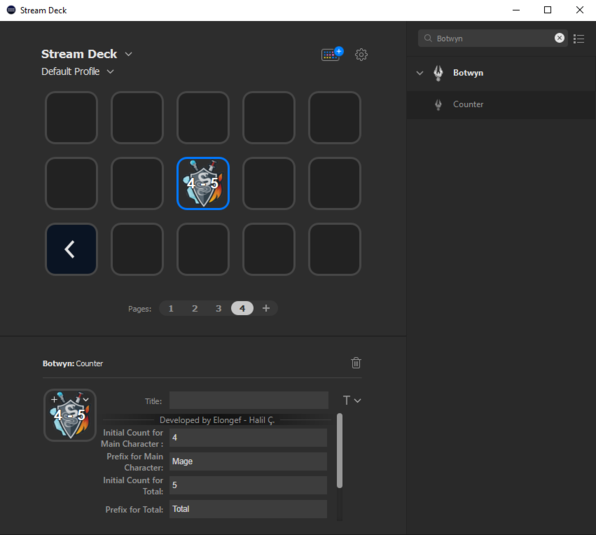

# Botwyn Stream Deck Plugin

## Description

A Counter Plugin for Stream Deck and Live Streams, Integrated with Counter Function of The [`Botwyn`](https://github.com/halilcifttur/eldwyn_botwyn)
## Features

- code written in C# and Javascript
- cross-platform (macOS, Windows)
- can be used with integrating the `Botwyn` or standalone (if you want to integrate the `Botwyn` you should add the necessary URLs in the plugin settings page)

    

- the plugin works with two counter
-- one for main character death count
-- one for total death count
-- the initial counts and the prefixes of both counters can be set from the plugin settings page

    

- short pressing increases both counters by 1 and long pressing decreases both counters by 1

    

- a folder named `Botwyn Death Counter` along with a text file named `Botwyn_Death_Counter.txt` inside of it will be created on the `Documents` folder after first pressing the counter

    

- the prefixes of both counters can be seen in the txt file

    

## I found a bug, who do I contact? I have a feature request, who do I contact?
Please contact the developer on Discord `Elongef#5854` 

## License

[MIT](LICENSE)